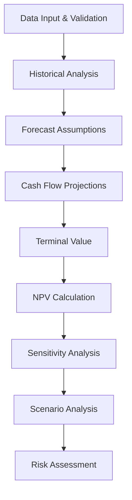

# 📊 Excel MCP Server - Financial Modeling Implementation Plan

## 🎯 Project Overview

This document outlines the comprehensive plan for implementing financial modeling capabilities in the Excel MCP Server. The goal is to transform the Excel MCP Server into a powerful financial analysis tool that supports DCF models, scenario analysis, risk assessment, and advanced Excel financial functions.

## ✅ Completed Features (Phase 1)

### 1. **Excel Data Validation** 📋
**Status**: ✅ COMPLETED  
**File**: `internal/tools/excel_data_validation.go`  
**Purpose**: Input controls and data integrity for financial models

**Capabilities**:
- Dropdown lists for scenario selection (`"Best Case"`, `"Base Case"`, `"Worst Case"`)
- Currency unit validation (`"USD"`, `"EUR"`, `"JPY"`)
- Percentage range validation (0-100%)
- Date range validation for budget periods
- Number range validation for financial inputs
- Text length validation for descriptions
- Custom formula validation

**Financial Modeling Applications**:
```json
{
  "type": "list",
  "listValues": ["Best Case", "Base Case", "Worst Case"],
  "showDropdown": true,
  "inputTitle": "Scenario Selection",
  "inputMsg": "Choose financial scenario for analysis"
}
```

### 2. **Excel Goal Seek** 🎯
**Status**: ✅ COMPLETED  
**File**: `internal/tools/excel_goal_seek.go`  
**Purpose**: Reverse calculation to find input values that achieve target results

**Capabilities**:
- Newton-Raphson algorithm implementation
- Iterative convergence with precision control
- Comprehensive result reporting
- Error handling and validation

**Financial Modeling Applications**:
- **IRR Calculation**: Find discount rate where NPV = 0
- **Break-even Analysis**: Find sales volume where profit = 0  
- **Loan Calculation**: Find principal amount for target monthly payment
- **Sensitivity Testing**: Find critical input values

**Usage Example**:
```json
{
  "formulaCell": "D20",    // NPV calculation cell
  "targetValue": 0,        // Target NPV = 0
  "variableCell": "B5",    // Discount rate cell
  "maxIterations": 100,
  "precision": 0.001
}
```

### 3. **Excel Data Table (What-If Analysis)** 📊
**Status**: ✅ COMPLETED  
**File**: `internal/tools/excel_data_table.go`  
**Purpose**: Scenario analysis and sensitivity analysis for multiple input combinations

**Capabilities**:
- One-input data tables (single variable analysis)
- Two-input data tables (matrix analysis)
- Automatic result matrix generation
- Comprehensive results preview

**Financial Modeling Applications**:
- **Single Variable Sensitivity**: How NPV changes with discount rates
- **Matrix Analysis**: NPV sensitivity to both discount rate AND growth rate
- **Monte Carlo Preparation**: Testing multiple parameter combinations
- **Scenario Planning**: Systematic what-if analysis

**Usage Examples**:

*One-Input Table*:
```json
{
  "formulaCell": "D20",           // NPV calculation
  "inputCell1": "B5",             // Discount rate
  "inputValues1": [0.08, 0.09, 0.10, 0.11, 0.12],
  "tableType": "one-input"
}
```

*Two-Input Table*:
```json
{
  "formulaCell": "D20",           // NPV calculation  
  "inputCell1": "B5",             // Discount rate
  "inputCell2": "B6",             // Growth rate
  "inputValues1": [0.08, 0.10, 0.12],
  "inputValues2": [0.02, 0.03, 0.04],
  "tableType": "two-input"
}
```

## 🚀 Planned Features (Remaining Phases)

### Phase 2: Core Financial Functions (HIGH PRIORITY)

#### 4. **Excel Financial Functions** 💰
**Status**: ❌ NOT IMPLEMENTED  
**File**: `internal/tools/excel_financial_functions.go` (TO BE CREATED)  
**Purpose**: Core financial calculation functions

**Required Functions**:
```go
// Time Value of Money Functions
NPV(rate, cashFlows)          // Net Present Value
IRR(cashFlows)                // Internal Rate of Return  
XNPV(rate, cashFlows, dates)  // NPV with specific dates
XIRR(cashFlows, dates)        // IRR with specific dates
PV(rate, nper, pmt)           // Present Value
FV(rate, nper, pmt, pv)       // Future Value
PMT(rate, nper, pv, fv)       // Payment amount
RATE(nper, pmt, pv, fv)       // Interest rate

// Loan Functions  
IPMT(rate, per, nper, pv)     // Interest payment
PPMT(rate, per, nper, pv)     // Principal payment
CUMIPMT(rate, nper, pv, start, end) // Cumulative interest
CUMPRINC(rate, nper, pv, start, end) // Cumulative principal

// Advanced Functions
MIRR(values, finance_rate, reinvest_rate) // Modified IRR
NPER(rate, pmt, pv, fv)       // Number of periods
EFFECT(nominal_rate, npery)    // Effective annual rate
```

#### 5. **Excel Lookup Functions** 🔍
**Status**: ❌ NOT IMPLEMENTED  
**File**: `internal/tools/excel_lookup_functions.go` (TO BE CREATED)  
**Purpose**: Data lookup and reference functions for financial models

**Required Functions**:
```go
VLOOKUP(lookup_value, table_array, col_index, exact_match)
HLOOKUP(lookup_value, table_array, row_index, exact_match)  
INDEX(array, row_num, col_num)
MATCH(lookup_value, lookup_array, match_type)
XLOOKUP(lookup_value, lookup_array, return_array) // Modern lookup
```

### Phase 3: Advanced Analysis Tools (MEDIUM PRIORITY)

#### 6. **Excel Charts and Graphs** 📈
**Status**: ❌ NOT IMPLEMENTED  
**File**: `internal/tools/excel_create_chart.go` (TO BE CREATED)  
**Purpose**: Financial data visualization

**Chart Types Needed**:
- Line charts for trend analysis
- Bar charts for comparison  
- Scatter plots for correlation analysis
- Waterfall charts for cash flow analysis
- Sensitivity analysis tornado charts

#### 7. **Excel Scenario Manager** 🎭
**Status**: ❌ NOT IMPLEMENTED  
**File**: `internal/tools/excel_scenario_manager.go` (TO BE CREATED)  
**Purpose**: Manage and compare multiple scenarios

**Capabilities**:
- Save/load scenario sets
- Compare scenarios side-by-side
- Scenario summary reports
- Probability-weighted scenarios

#### 8. **Excel Named Ranges** 🏷️
**Status**: ❌ NOT IMPLEMENTED  
**File**: `internal/tools/excel_named_ranges.go` (TO BE CREATED)  
**Purpose**: Better model organization and maintenance

**Capabilities**:
- Create/modify named ranges
- Dynamic named ranges
- Scope management (workbook vs worksheet)
- Named range listing and documentation

### Phase 4: Risk Analysis and Advanced Features (MEDIUM-LOW PRIORITY)

#### 9. **Excel Monte Carlo Simulation** 🎲
**Status**: ❌ NOT IMPLEMENTED  
**File**: `internal/tools/excel_monte_carlo.go` (TO BE CREATED)  
**Purpose**: Risk analysis and probabilistic modeling

**Capabilities**:
- Random variable generation (Normal, Uniform, Triangular distributions)
- Multiple iteration simulation  
- Statistical result analysis
- Confidence intervals and percentiles
- Risk metrics calculation

#### 10. **Excel Pivot Tables** 📋
**Status**: ❌ NOT IMPLEMENTED  
**File**: `internal/tools/excel_pivot_table.go` (TO BE CREATED)  
**Purpose**: Data aggregation and analysis

**Capabilities**:
- Create pivot tables from data ranges
- Configure fields (rows, columns, values, filters)
- Calculated fields and items
- Pivot table refresh and updates

### Phase 5: Templates and Integration (LOW PRIORITY)

#### 11. **Excel Financial Templates** 📄
**Status**: ❌ NOT IMPLEMENTED  
**File**: `internal/tools/excel_financial_templates.go` (TO BE CREATED)  
**Purpose**: Pre-built financial model templates

**Template Types**:
- DCF (Discounted Cash Flow) model
- Three-statement model (P&L, Balance Sheet, Cash Flow)
- LBO (Leveraged Buyout) model
- Budget and forecast templates
- Loan amortization schedules

#### 12. **Excel External Data** 🔗
**Status**: ❌ NOT IMPLEMENTED  
**File**: `internal/tools/excel_external_data.go` (TO BE CREATED)  
**Purpose**: Connect to external data sources

**Data Sources**:
- CSV import/export
- Database connections
- API data feeds
- Real-time financial data

## 💡 Implementation Strategy

### Technical Approach
1. **No Custom Function Engine**: Use existing Excel formula calculation capabilities
2. **Excelize Backend Focus**: Primary implementation using Excelize library
3. **OLE Backend Support**: Windows-specific advanced features when available
4. **MCP Tool Pattern**: Each feature as a separate MCP tool
5. **Comprehensive Testing**: Financial accuracy validation

### Development Priorities
1. **Phase 2 First**: Core financial functions (NPV, IRR, PMT, etc.)
2. **Integration Testing**: Ensure all tools work together seamlessly  
3. **Real-world Validation**: Test with actual financial models
4. **Performance Optimization**: Handle large datasets efficiently
5. **Documentation**: Comprehensive usage examples

### Financial Modeling Use Cases

#### DCF Model Workflow


#### Key Formulas Integration
```excel
// Core DCF Formula
NPV = XNPV(WACC, CashFlows, Dates) + TerminalValue/(1+WACC)^Years

// Sensitivity Analysis using Data Tables
// Goal Seek for break-even IRR
// Monte Carlo for risk analysis
```

## 📊 Success Metrics

### Functional Metrics
- ✅ All core financial functions implemented
- ✅ Scenario analysis capabilities complete
- ✅ Risk analysis tools functional
- ✅ Integration with Claude Desktop seamless

### Performance Metrics  
- Response time < 2 seconds for calculations
- Support for models with 1000+ cells
- Memory usage < 100MB for typical models
- Error rate < 0.1% for financial calculations

### User Experience Metrics
- Intuitive MCP tool interfaces
- Comprehensive result reporting
- Clear error messages and validation
- Rich HTML output with visual formatting

## 🎯 Current Status Summary

**Completed**: 3/12 features (25%)
- ✅ Data Validation  
- ✅ Goal Seek
- ✅ Data Tables

**Next Priority**: Excel Financial Functions (Phase 2)
**Timeline**: 2-3 weeks per phase
**Total Estimated Completion**: 8-12 weeks

---

*This plan provides a roadmap for transforming the Excel MCP Server into a comprehensive financial modeling platform. Each phase builds upon previous capabilities, ensuring a solid foundation for advanced financial analysis.*